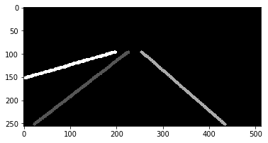
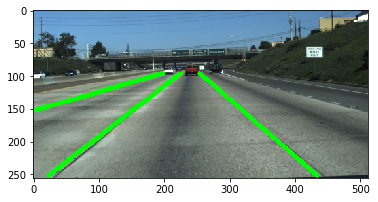
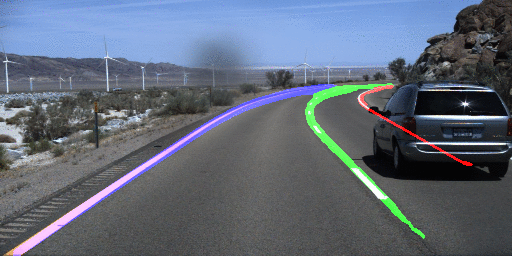

# LaneNet - Lane Detection Using Neural Networks

Pytorch implementation of lane detection networks. This is mainly based on the approach proposed in [Towards End-to-End Lane Detection: an Instance Segmentation Approach](https://arxiv.org/abs/1802.05591). This model simultaneously optimizes a binary semantic segmentation network using cross entropy loss, and a (lane) instance semantic segmentation using discriminative loss.

## Installation
This code has been tested on ubuntu 16.04(x64), python3.7, pytorch-0.4.1, cuda-9.0 with a GTX-1060 GPU. 
The Python environment can be imported from the `requirements.txt` file:
```
pip install -r requirements.txt
```

## Download data
- Edit the Makefile file and set the input directory $(IN_DIR) location. This is place where the dataset will be stored. If you already downloaded the data, then you can skip this step.
- Download [TuSimple dataset](https://github.com/TuSimple/tusimple-benchmark/wiki): `make download`.  Then extract the data.

- Input data format (of TuSimple dataset, as described [here](https://github.com/TuSimple/tusimple-benchmark/tree/master/doc/lane_detection))
```
{
      'raw_file': str. 20th frame file path in a clip.
      'lanes': list. A list of lanes. For each list of one lane, the elements are width values on image.
      'h_samples': list. A list of height values corresponding to the 'lanes', which means len(h_samples) == len(lanes[i])
}
```

For example,
```
{
  "lanes": [
        [-2, -2, -2, -2, 632, 625, 617, 609, 601, 594, 586, 578, 570, 563, 555, 547, 539, 532, 524, 516, 508, 501, 493, 485, 477, 469, 462, 454, 446, 438, 431, 423, 415, 407, 400, 392, 384, 376, 369, 361, 353, 345, 338, 330, 322, 314, 307, 299],
        [-2, -2, -2, -2, 719, 734, 748, 762, 777, 791, 805, 820, 834, 848, 863, 877, 891, 906, 920, 934, 949, 963, 978, 992, 1006, 1021, 1035, 1049, 1064, 1078, 1092, 1107, 1121, 1135, 1150, 1164, 1178, 1193, 1207, 1221, 1236, 1250, 1265, -2, -2, -2, -2, -2],
        [-2, -2, -2, -2, -2, 532, 503, 474, 445, 416, 387, 358, 329, 300, 271, 241, 212, 183, 154, 125, 96, 67, 38, 9, -2, -2, -2, -2, -2, -2, -2, -2, -2, -2, -2, -2, -2, -2, -2, -2, -2, -2, -2, -2, -2, -2, -2, -2],
        [-2, -2, -2, 781, 822, 862, 903, 944, 984, 1025, 1066, 1107, 1147, 1188, 1229, 1269, -2, -2, -2, -2, -2, -2, -2, -2, -2, -2, -2, -2, -2, -2, -2, -2, -2, -2, -2, -2, -2, -2, -2, -2, -2, -2, -2, -2, -2, -2, -2, -2]
       ],
  "h_samples": [240, 250, 260, 270, 280, 290, 300, 310, 320, 330, 340, 350, 360, 370, 380, 390, 400, 410, 420, 430, 440, 450, 460, 470, 480, 490, 500, 510, 520, 530, 540, 550, 560, 570, 580, 590, 600, 610, 620, 630, 640, 650, 660, 670, 680, 690, 700, 710],
  "raw_file": "path_to_clip"
}
```
- Output data format. Given a list of `h_samples`, output a list of lanes with x-coordinate for each lane.
```
{
  'raw_file': str. 20th frame file path in a clip.
  'lanes': list. A list of lanes. For each list of one lane, there is only width index on the image.
  'run_time': list of float. The running time for each frame in the clip. The unit is millisecond.
}
```

## Generate training image/label from raw input in aforementioned format
Lane detection is an image segmention task. Each pixel will have a label that indicates whether it belongs to a lane or not. Furthermore, we use different id to label different lane. 

<table style="width:100%">
  <tr>
    <th>
      <p align="center">
 <a href="https://youtu.be/WBNw1tKe4xE"></a>
 <br>Original image
</p>
    </th>
    <th>
      <p align="center">
 <a href="https://youtu.be/2TiQuKux3JU"></a>
 <br>Label image
</p>
    </th>
    <th>
      <p align="center">
 <a href="https://youtu.be/enVAMUN2qmE"></a>
 <br>Overlay image
</p>
    </th>
  </tr>
</table>

## Generate train/val/test splits
- Run: `make matadata` to generate train/val/test split. Note that currently the test labels are not available, so we cannot do the quantitative evaluation yet. 

## Train model
- Run `make train`

```
usage: train.py [-h] [--image_dir IMAGE_DIR] [--cnn_type {unet}]
                [--batch_size BATCH_SIZE] [--width WIDTH] [--height HEIGHT]
                [--thickness THICKNESS] [--max_lanes MAX_LANES]
                [--learning_rate LEARNING_RATE] [--num_epochs NUM_EPOCHS]
                [--lr_update LR_UPDATE] [--max_patience MAX_PATIENCE]
                [--val_step VAL_STEP] [--num_workers NUM_WORKERS]
                [--log_step LOG_STEP]
                [--loglevel {DEBUG,INFO,WARNING,ERROR,CRITICAL}] [--seed SEED]
                meta_file output_file
```

## Test model
- Run `make test_tusimple`

```
usage: test.py [-h] [--meta_file META_FILE] [--output_file OUTPUT_FILE]
               [--image_dir IMAGE_DIR] [--save_dir SAVE_DIR]
               [--image_ext IMAGE_EXT] [--loader_type {meta,dir,tutest}]
               [--batch_size BATCH_SIZE] [--num_workers NUM_WORKERS]
               [--show_demo] [--loglevel {DEBUG,INFO,WARNING,ERROR,CRITICAL}]
               model_file
```
## Evaluation on TuSimple's Benchmark
- Run `eval_tusimple`. This will need the evaluation script from the [organizer](https://github.com/TuSimple/tusimple-benchmark). If you haven't clone it yet, you can do it by `git submodule update --init --recursive`. This evaluation script require Python 2 to run. You can create a seperate enviroment named `py2` for the evaluation. 


## Current Results:

### On TuSimple Dataset 
|Model|Accuracy|FP|FN|
|:---:|:---:|:---:|:---:|
|[SCNN](https://github.com/XingangPan/SCNN)|96.53%|0.0617|0.0180|
| LaneNet (UNet) |95.22% | 0.1026 |0.0616 |
| LaneNet (DeeplabV3+) |95.28% | 0.0590 |0.0583 |

### On CULane Dataset

| F1-measure@IoU | IoU=0.3                      | IoU=0.5 |
|----------------|------------------------------|---------|
|[SCNN](https://github.com/XingangPan/SCNN)|    80.6      | 71.6    |
| LaneNet (U-Net)  | 68.68 (P=65.49, R=72.19)     | 51.99 (P=49.58, R=54.65)    |
| LaneNet (DeepLabV3)| 78.44 (P=75.03, R=82.17)     | 68.79 (P=65.80, R=72.07)    |

## Demo 
- Run `demo_tusimple` to view the results of lane detection on TuSimple test images.

- Lane detection results on TuSimple's test images
<p align="center">
 <a href="https://youtu.be/tFj3mUFFbIw"></a>
 <br>Lane detection on TuSimple's test images (click for full video)
</p>

## Notebooks
- Check out the notebook to view groundtruth data [here](notebooks/view_groundtruth.ipynb), and to view examples of prediction results [here](notebooks/view_prediction.ipynb).

## Acknowledgements
- [Implemention of lanenet model for real time lane detection using deep neural network model](https://github.com/MaybeShewill-CV/lanenet-lane-detection)
- [Semantic Instance Segmentation with a Discriminative Loss Function in PyTorch](https://github.com/Wizaron/instance-segmentation-pytorch)
- [Implementation of discriminative loss for instance segmentation by pytorch](https://github.com/nyoki-mtl/pytorch-discriminative-loss)

## Tasks

### Finished
- [x] Train/Test on TuSimple dataset
- [x] Train/Test on CULane dataset
- [x] Train/Test on BDD dataset
- [x] Add other SoA lane detection networks, such as [SCNN](https://github.com/XingangPan/SCNN) -- implemented the SCNN module, but not able to get good results yet. Also supported Deeplab.  
### TODO
- [x] Combining Drivable detection and lane detection
- [x] Use H-Net for curve fitting 
